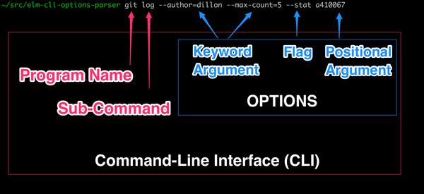

# Elm CLI Options Parser

`elm-cli-options-parser` allows you to build command-line options parsers in Elm.
It uses a syntax similar to `Json.Decode.Pipeline`.

Main goals:

1. Separate the definition of the contract and the business logic... contract enforcement
   is declarative rather than low-level steps which can be error prone and hard to read.
1. You either have the data you think you have, or else the user sees a nice, clear error
   message (no in between where you check if the data is there but in one variation it's not
   , for example the `init` sub command has a `--verbose` flag but the `` sub command doesn't.
   You can't check for the `verbose` value unless it's there).
1. Guaranteed to be in-sync - the parsers and the help message, the parsers and the data
   you get back, the error messages and the parsers.
1. Be explicit - like the Elm ethos, this library aims to give you very clear error
   messages the minute it knows you did something wrong. For example, if you
   pass in an unrecognized flag, you will immediately get an error.
1. Ensure that you create a good UX... for example, single letter switches are confusing
   (for example, `grep -v` is an alias for `--invert-match`. And there is a confusing
   and somewhat ambiguous syntax for passing arguments to arguments (for example, you can
   group multiple flags like `grep -veabc`, which is the same as
   `grep --invert-match --regexp=abc`. This is "write-only", and this library is
   opinionated about doing things in a way that is very explicit, unambiguous,
   and easy to understand).

It's far less confusing
).
And the `--help` flag should always be there and do a standard thing... so this is
baked into the library.

## Example

See the `examples` folder for full end-to-end examples, including how to wire
your Elm options parser up through NodeJS so it can receive the command line input.

Take this `git` command:

```console
git log --author=dillon --max-count=5 --stat a410067
```

To parse the above command, we could build a `Program` as follows (this snippet doesn't include the wiring of the OptionsParser-Line options from NodeJS, see the `examples` folder):

```elm
import Cli.OptionsParser as OptionsParser exposing (OptionsParser, with)
import Cli.Option as Option
import Cli.Program


type GitOptionsParser
    = Init
    | Clone String
    | Log LogOptions


type alias LogOptions =
    { maybeAuthorPattern : Maybe String
    , maybeMaxCount : Maybe Int
    , statisticsMode : Bool
    , maybeRevisionRange : Maybe String
    }

logOptionsParser : OptionsParser LogOptions
logOptionsParser =
    OptionsParser.buildSubOptionsParser "log" LogOptions
        |> with (Cli.Option.optionalKeywordArg "author")
        |> with
            (Cli.Option.optionalKeywordArg "max-count"
                |> Cli.Option.validateMapIfPresent String.toInt
            )
        |> with (Cli.Option.flag "stat")
        |> OptionsParser.endWith
            (Cli.Option.optionalPositionalArg "revision range")


cli : Cli.Program.StatelessProgram GitOptionsParser
cli =
    { programName = "git"
    , commands = commands
    , version = "1.2.3"
    }


commands : List (OptionsParser GitOptionsParser)
commands =
    [ OptionsParser.map Log logOptionsParser
      -- ... `OptionsParser`s for `Init`, `Clone`, etc. here
      -- See `examples` folder
    ]
```

```elm
{-
Now running:
`git log --author=dillon --max-count=5 --stat a410067`
will yield the following output (with wiring as in the `examples` folder):
-}
matchResult : GitOptionsParser
matchResult =
    Log
        { maybeAuthorPattern = Just "dillon"
        , maybeMaxCount = Just 5
        , statisticsMode = True
        , revisionRange = Just "a410067"
        }
```

It will also generate the help text for you, so it's guaranteed to be in sync.
The example code above will generate the following help text:

```console
$ ./git --help
git log [--author <author>] [--max-count <max-count>] [--stat] [<revision range>]
```

Note: the `--help` option is a built-in command, so no need to write a `OptionsParser` for that.

## Options Parser Terminology

Here is a diagram to clarify the terminology used by this library. Note that
terms can vary across different standards. For example, posix uses the term
`option` for what this library calls a `keyword argument`. I chose these terms
because I found them to be the most intuitive and unambiguous.



## Some Inspiration for this package

* http://pubs.opengroup.org/onlinepubs/9699919799/basedefs/V1_chap12.html.
* https://pythonconquerstheuniverse.wordpress.com/2010/07/25/command-line-syntax-some-basic-concepts/
* https://devcenter.heroku.com/articles/cli-style-guide
* http://docopt.org/
